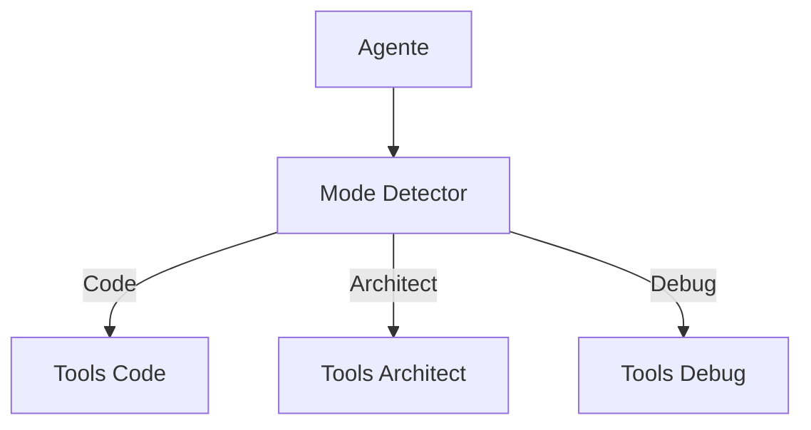

# Roo-Code — Sistema de Ferramentas

## Arquitetura

O Roo-Code tem ferramentas por modo:

## Tools por Modo

| Modo | Tools |
|------|-------|
| Code | read, write, edit, bash |
| Architect | plan, search, write |
| Ask | search, read |
| Debug | read, bash, debug |

## Pontos Fortes

1. Tools especializadas por modo

## Limitações

1. Descontinuado
2. Sem MCP tools

## Oportunidades para o XForge

1. Tools por modo + MCP