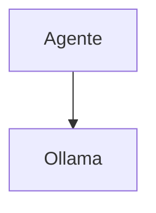

# Twinny — Sistema de Ferramentas

## Arquitetura

O Twinny tem ferramentas mínimas:

## Limitações

1. Sem tools avançadas
2. Apenas chat

## Oportunidades para o XForge

1. Adicionar tools básicas