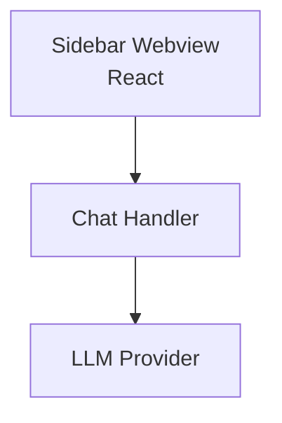

# MiMo-Code — Interface do Usuário

## Arquitetura

O MiMo-Code é uma extensão VS Code leve:

## Componentes

| Componente | Tecnologia | Descrição |
|------------|------------|-----------|
| Sidebar | React | Painel lateral |
| Chat Input | React | Campo de entrada |
| Message List | React | Lista de mensagens |

## Funcionalidades

1. **Leve** — Instalação e execução rápidas
2. **Multi-provedor** — Suporte a vários LLMs
3. **Simples** — Fácil de usar

## Stack

| Tecnologia | Versão |
|------------|--------|
| React | latest |
| TypeScript | 5.x |
| VS Code API | latest |

## Pontos Fortes

1. Leve
2. Simples
3. Rápido

## Limitações

1. Funcionalidades limitadas
2. Sem MCP
3. Sem tools avançadas

## Oportunidades para o XForge

1. Simplicidade + modos especializados