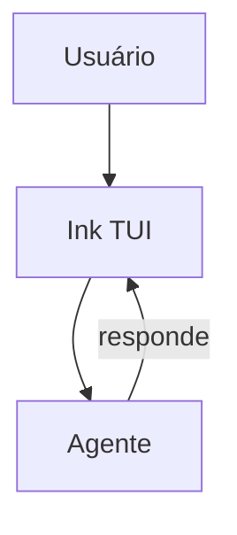

# OpenCode — Interface do Usuário

## Arquitetura

O OpenCode usa Ink (React para terminal):

## Componentes

| Componente | Tecnologia | Descrição |
|------------|------------|-----------|
| TUI | Ink | Terminal UI |
| Commands | Ink | Comandos CLI |
| Help System | Ink | Sistema de ajuda |

## Funcionalidades

1. **TUI** — Interface de terminal interativa
2. **Single-binary** — Instalação simples
3. **Multi-provedor** — Suporte a vários LLMs
4. **Comandos CLI** — Atalhos de teclado

## Stack

| Tecnologia | Versão |
|------------|--------|
| Ink | latest |
| TypeScript | 5.x |
| Node.js | latest |

## Pontos Fortes

1. TUI minimalista
2. Single-binary
3. Rápido

## Limitações

1. Sem GUI rica
2. Sem streaming
3. Sem MCP

## Oportunidades para o XForge

1. TUI + GUI (VS Code extension)