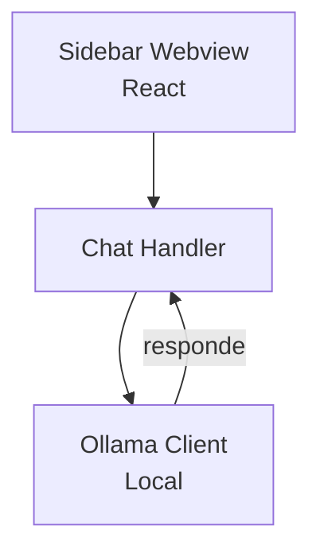

# Twinny — Interface do Usuário

## Arquitetura

O Twinny é uma extensão VS Code minimalista focada em local-first:

## Componentes

| Componente | Tecnologia | Descrição |
|------------|------------|-----------|
| Sidebar | React | Painel lateral simples |
| Chat Input | React | Campo de entrada |
| Chat History | React | Histórico local |
| Ollama Client | TypeScript | Cliente Ollama local |

## Funcionalidades

1. **Local-first** — Sem cloud, máxima privacidade
2. **Ollama integration** — Modelos locais (Qwen, Llama, etc.)
3. **Chat básico** — Conversa simples
4. **Code completion** — Básico
5. **VS Code Extension** — Instalação simples

## Stack

| Tecnologia | Versão |
|------------|--------|
| React | latest |
| TypeScript | 5.x |
| VS Code API | latest |
| Ollama | latest |

## Pontos Fortes

1. Privacidade (sem cloud)
2. Leve e rápido
3. Fácil de usar

## Limitações

1. Sem tools avançadas
2. Sem MCP
3. Sem streaming
4. Sem multi-sessão
5. Sem per-directory rules

## Oportunidades para o XForge

1. Local-first + RAG híbrido
2. Ollama + cloud fallback