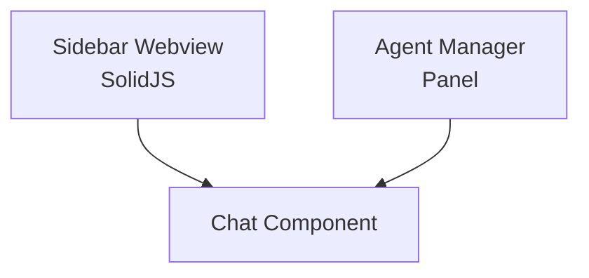

# Kilo Code — Interface do Usuário

## Arquitetura

O Kilo Code usa SolidJS para a webview:

## Componentes

| Componente | Tecnologia | Descrição |
|------------|------------|-----------|
| Sidebar | SolidJS | Painel lateral de chat |
| Agent Manager | SolidJS | Painel multi-sessão |
| Chat Input | SolidJS | Campo de entrada |
| Message List | SolidJS | Lista de mensagens |
| Diff View | SolidJS | Preview de mudanças |
| Mode Selector | SolidJS | Seletor de modo |

## Funcionalidades

1. **Multi-sessão** — Múltiplas conversas simultâneas
2. **Agent Manager** — Painel de orquestração
3. **Worktree Isolation** — Sessões isoladas
4. **Streaming** — Respostas em tempo real
5. **Diff View** — Preview com accept/reject
6. **Dark Mode** — Tema escuro

## Atalhos

| Atalho | Ação |
|--------|------|
| Ctrl+K | Abre chat |
| Ctrl+Shift+K | Abre Agent Manager |
| Tab | Aceita sugestão |

## Stack

| Tecnologia | Versão |
|------------|--------|
| SolidJS | latest |
| TypeScript | 5.x |
| Vite | latest |

## Pontos Fortes

1. Agent Manager único
2. Worktree isolation
3. Dark mode

## Limitações

1. Sem voice input
2. Sem mobile