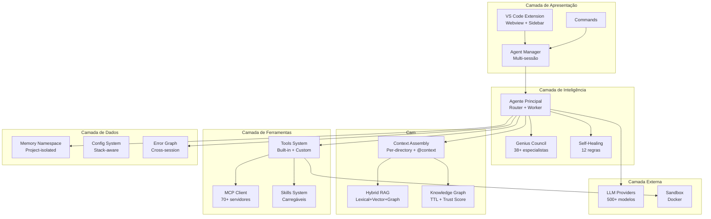

# XForge Code AI — Especificação de Arquitetura

## Visão Geral

O XForge Code AI é uma extensão VS Code de próxima geração que combina o melhor dos 10 projetos de referência analisados (Kilo Code, Cline, Continue, Goose, Roo-Code, Aider, OpenHands, Twinny, MiMo-Code, OpenCode) em uma arquitetura superior e inédita.

## Diferenciais Arquiteturais

### 1. Genius Council Framework (GCF)
- 38+ virtuais especialistas debatem cada decisão não-trivial
- Devil's Advocate stress-testa decisões
- 5 Guardiões validam (Architecture, Simplicity, Security, Quality, Documentation)
- Decision Records automáticos

### 2. Per-Directory AGENTS.md (findUp)
- Diferentes instruções por diretório do monorepo
- Descoberta automática subindo na árvore (max 3 níveis)
- Instruções do diretório têm precedência sobre as do root

### 3. Self-Healing Rules (SH-001 a SH-012)
- Auto-correção de erros comuns antes do build
- Unused imports, missing async, null checks, parameterized queries
- Error graph rastreia padrões entre sessões

### 4. Living Knowledge Graph
- Entradas de conhecimento com TTL e trust score
- Auto-promoção de padrões validados
- Auto-depreciação de conhecimento obsoleto

### 5. Memory Namespace Isolation
- Memória isolada por projeto (LGPD compliance)
- Cross-project learning apenas via DR + human approval
- User preferences são cross-project

### 6. Stack-Agnostic (Golden Rule 0)
- Detecta stack do projeto e adapta TODA a comportamento
- Suporte a .NET, Node, Python, Go, Rust, Java, HTML+Tailwind
- Padrões específicos por stack

### 7. Hybrid RAG (Lexical + Vector + Structural + Graph)
- Busca full-text + embeddings + AST + knowledge graph
- Melhor recall e precisão que qualquer abordagem isolada

### 8. Checkpoint + Resume com Estado Completo
- Serialização completa: contexto, decisões, arquivos modificados, próximos passos
- Retomada exatamente de onde parou

## Arquitetura Proposta



## Componentes Principais

| Componente | Responsabilidade | Inspirado em |
|------------|------------------|--------------|
| Genius Council | Multi-perspectiva AI debate | Nenhum (inédito) |
| Agent Manager | Orquestração multi-sessão | Kilo Code |
| Router + Worker | Roteamento + execução | Kilo Code |
| Per-directory AGENTS | Regras por diretório | Kilo Code |
| Self-healing | Auto-correção de erros | Nenhum (inédito) |
| Knowledge Graph | Conhecimento vivo | Nenhum (inédito) |
| Hybrid RAG | Busca híbrida | Kilo Code + Continue |
| Memory Namespace | Isolamento por projeto | Nenhum (inédito) |
| Stack Detection | Adaptação por stack | Nenhum (inédito) |
| Checkpoint+Resume | Estado completo | Cline |
| MCP Integration | Ferramentas externas | Goose |
| Skills System | Fluxos carregáveis | Kilo Code |
| Error Graph | Aprendizado de erros | Nenhum (inédito) |

## Estrutura de Diretórios Proposta

```
src/
  extension.ts              # Entry point
  commands/                 # Comandos registrados
  providers/                # Providers de webview
  services/
    agent/                  # Sistema de agentes
      genius-council/      # Genius Council Framework
      router/               # Router model
      worker/               # Worker model
      modes/                # Modos (Code, Plan, Ask, Debug, Review)
    context/                # Montagem de contexto
      per-directory/        # findUp discovery
      rag/                  # Hybrid RAG
      knowledge-graph/      # Knowledge Graph
    memory/                 # Sistema de memória
      namespace/            # Project isolation
      learning/             # Error graph + patterns
      rules/                # AGENTS.md + per-directory
    tools/                  # Sistema de ferramentas
      built-in/             # read, write, edit, bash, search
      custom/               # User-defined tools
      mcp/                  # MCP client
      self-healing/         # SH-001 a SH-012
    providers/              # Provedores LLM
      router/               # Split architecture
      fallback/             # Fallback chain
      registry/             # 500+ modelos
    chat/                   # Sistema de chat
      webview/              # UI components
      message-handler/      # Streaming
      commands/             # Slash commands
    security/               # Segurança
      permissions/          # Glob patterns
      secrets/              # Secret detection
      sandbox/              # Docker sandbox
  webview-ui/               # Interface do usuário
```

## Critérios de Aceite

- [ ] Extensão VS Code instala e ativa corretamente
- [ ] Genius Council debate decisões arquiteturais
- [ ] Per-directory AGENTS.md funciona em monorepos
- [ ] Self-healing corrige erros automaticamente
- [ ] Knowledge Graph tem TTL e trust score
- [ ] Memory é isolada por projeto
- [ ] Stack detection identifica .NET, Node, Python, Go, Rust, Java
- [ ] Hybrid RAG busca em 4 fontes
- [ ] Checkpoint + Resume funciona entre sessões
- [ ] MCP conecta a servidores externos
- [ ] Skills são carregáveis dinamicamente
- [ ] Error Graph rastreia padrões entre sessões

## Prioridade

| Componente | Prioridade | Justificativa |
|------------|------------|---------------|
| Agent Core (Router+Worker) | P0 | Fundação de tudo |
| Context Assembly | P1 | Base para respostas |
| Tools System | P1 | Ação do agente |
| Genius Council | P1 | Diferencial principal |
| Memory Namespace | P2 | LGPD compliance |
| Self-Healing | P2 | Qualidade |
| Hybrid RAG | P2 | Busca superior |
| Per-directory AGENTS | P2 | Monorepo support |
| MCP Integration | P3 | Extensibilidade |
| Knowledge Graph | P3 | Conhecimento vivo |
| Stack Detection | P3 | Stack-agnostic |
