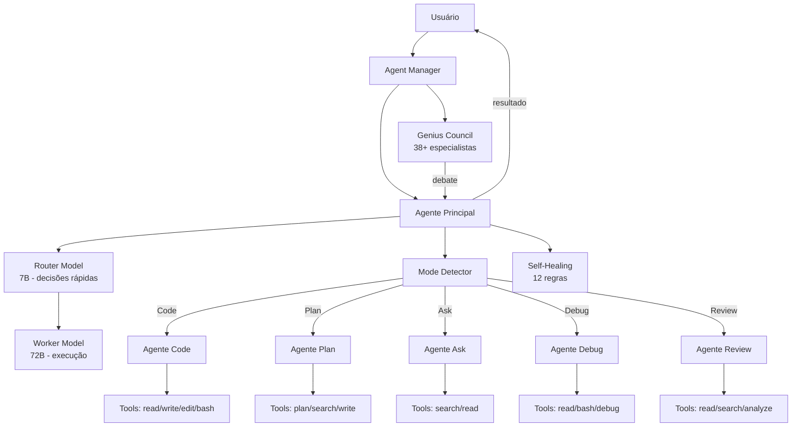
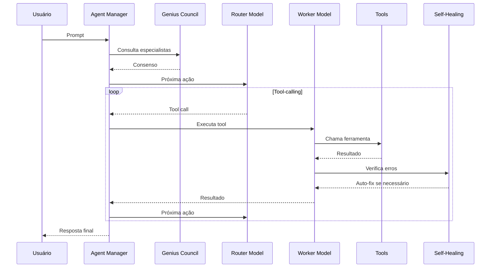

# XForge Code AI — Sistema de Agentes

## Visão Geral

O sistema de agentes do XForge Code AI é o coração do produto. Ele combina o melhor de Kilo Code (Agent Manager), Cline (multi-agent teams), Roo-Code (modos especializados) e adiciona o Genius Council — um diferencial inédito.

## Arquitetura de Agentes

## Component### 1. Agent Manager
- Orquestra múltiplas sessões simultâneas
- Git worktree isolation por sessão
- Estado compartilhado entre sessões do mesmo projeto
- Interface de gerenciamento no sidebar

### 2. Genius Council Framework (GCF)
- 38+ especialistas virtuais com perspectivas únicas
- Debate estruturado antes de decisões não-trivial
- Devil's Advocate com 7 perguntas obrigatórias
- 5 Guardiões para validação
- Decision Record automático

### 3. Router + Worker Architecture
- Router Model (7B): decisões rápidas, baixo custo
- Worker Model (72B): execução de alta qualidade
- Fallback chain: 7B → 14B → 72B
- Custo reduzido em 60-80% vs single-model

### 4. Modos de Agente

| Modo | Descrição | System Prompt | Tools |
|------|-----------|---------------|-------|
| **Code** | Implementação de código | Expert developer | read, write, edit, bash, search |
| **Plan** | Planejamento de arquitetura | Architect + Planner | plan, search, write |
| **Ask** | Respostas sem tocar código | Code reviewer | search, read |
| **Debug** | Resolução de problemas | Debugger + Tracer | read, bash, debug, search |
| **Review** | Revisão de mudanças | Security + Quality reviewer | read, search, analyze |

### 5. Self-Healing Rules

| ID | Regra | Auto-fix |
|----|-------|----------|
| SH-001 | Remove unused imports | Sim |
| SH-002 | Add Async suffix | Sim |
| SH-003 | Null-conditional access | Sim |
| SH-004 | Missing null check | Sim |
| SH-005 | Async over sync | Sim |
| SH-006 | Missing using declaration | Sim |
| SH-007 | Parameterized query | Sim |
| SH-008 | Secret detection | Parcial |
| SH-009 | CancellationToken | Sim |
| SH-010 | IHttpClientFactory | Parcial |
| SH-011 | ConfigureAwait | Silencioso |
| SH-012 | Disposable pattern | Parcial |

### 6. Agent Loop

## Critérios de Aceite

- [ ] Agent Manager cria e gerencia múltiplas sessões
- [ ] Genius Council debate e consolida decisões
- [ ] Router + Worker funciona com fallback
- [ ] 5 modos de agente funcionam corretamente
- [ ] Self-healing corrige erros automaticamente
- [ ] Agent loop é estável e não entra em loop infinito
- [ ] Worktree isolation funciona por sessão

## Prioridade: P0
