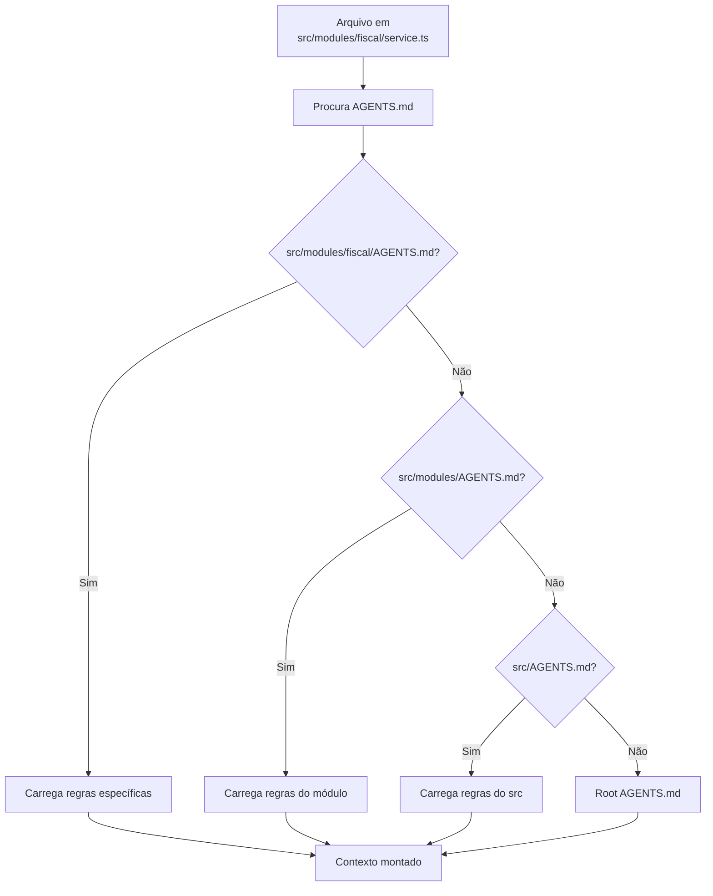
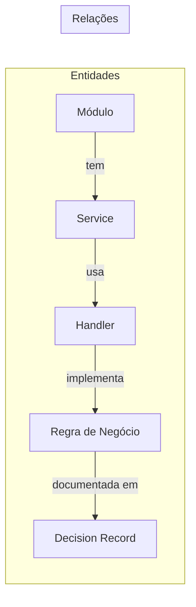

# XForge Code AI — Sistema de Contexto

## Visão Geral

O sistema de contexto do XForge Code AI é o mais avançado entre todos os projetos analisados. Ele combina o @context system do Continue, o repo mapping do Aider, o RAG do Kilo Code, e adiciona per-directory rules e knowledge graph.

## Componentes

```mermaid
graph TD
    U[Usuário] -->|@file/@folder| CTX[Context Provider]
    CTX -->|resolve| REF[Reference Resolver]
    REF -->|busca| IDX[Hybrid Index]
    IDX -->|lexical| LEX[Full-text Search]
    IDX -->|vector| VEC[Embedding Search\nOllama nomic-embed]
    IDX -->|structural| AST[AST Analysis]
    IDX -->|graph| KG[Knowledge Graph]
    CTX -->|carrega| PD[Per-directory Rules\nfindUp max 3 levels]
    PD -->|carrega| AG[AGENTS.md]
    CTX -->|monta| PROMPT[Prompt Assembly]
    PROMPT -->|envia| LLM[LLM]
```

## 1. @context System

| Comando | Descrição |
|---------|-----------|
| `@file src/main.ts` | Inclui arquivo específico |
| `@folder src/` | Inclui todos os arquivos da pasta |
| `@codebase` | Inclui estrutura completa do projeto |
| `@docs` | Inclui documentação indexada |
| `@git` | Inclui contexto do git (commits, diffs) |

## 2. Per-Directory AGENTS.md (findUp)



### Regras de Precedência
1. Diretório mais próximo vence
2. Max 3 níveis de profundidade
3. Arquivos podem ter instruções específicas por extensão

## 3. Hybrid RAG

| Tipo | Tecnologia | Uso |
|------|------------|-----|
| Lexical | Busca full-text | Palavras-chave exatas |
| Vector | Ollama nomic-embed-text | Busca semântica |
| Structural | AST analysis | Estrutura do código |
| Graph | Knowledge Graph | Relações entre entidades |

## 4. Knowledge Graph



### TTL e Trust Score

| Campo | Descrição |
|-------|-----------|
| trustScore | 0-100, decai com o tempo |
| createdAt | Data de criação |
| lastValidated | Última revalidação |
| ttl | Tempo de validade (dias) |
| status | active/deprecated/promoted |

## 5. Context Assembly Pipeline

1. Coleta arquivos referenciados (@file, @folder)
2. Carrega per-directory AGENTS.md (findUp)
3. Adiciona Knowledge Graph relevante
4. Adiciona histórico de mensagens
5. Verifica limite de tokens
6. Comprime se necessário (compaction)
7. Envia para LLM

## Critérios de Aceite

- [ ] @file, @folder, @codebase, @docs funcionam
- [ ] Per-directory AGENTS.md com findUp (max 3 níveis)
- [ ] Hybrid RAG busca em 4 fontes
- [ ] Knowledge Graph com TTL e trust score
- [ ] Context assembly respeita limites de tokens
- [ ] Compaction preserva informações críticas

## Prioridade: P0
