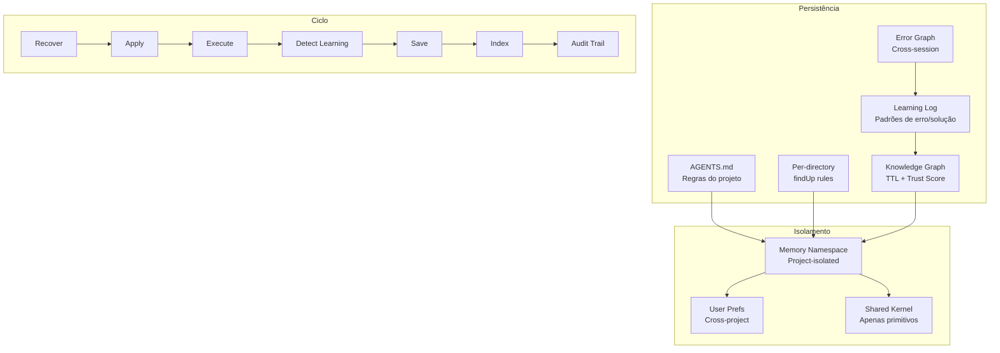
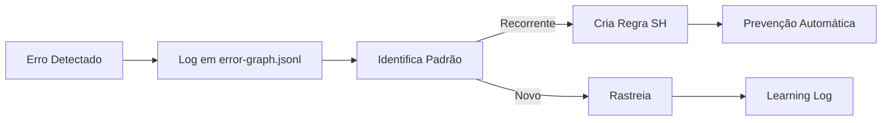

# XForge Code AI — Sistema de Memória

## Visão Geral

O sistema de memória do XForge Code AI é o mais completo entre todos os projetos analisados. Ele combina rules/AGENTS.md do Kilo Code, checkpoints do Cline, e adiciona memory namespace isolation, error graph, e learning contínuo.

## Componentes



## 1. Memory Namespace Isolation

| Caminho | Escopo | Pode vazar? |
|---------|--------|-------------|
| `.xforge/memory/_user/` | Preferências do usuário | Sim (cross-project) |
| `.xforge/memory/_project/<id>/` | Estado do projeto | Não |
| `.xforge/memory/global/` | Conhecimento universal | Não |
| `.xforge/knowledge/` | Conhecimento curado | Não |
| `.xforge/decisions/` | Decision Records | Não |

### Regras de Isolamento
- Memória de projeto A NUNCA vaza para projeto B
- Cross-project learning requer DR + human approval
- User preferences são cross-project por natureza
- Knowledge entries com `applicabilityScope: ["*"]` são compartilhadas

## 2. Error Graph



### Schema de Entrada

```json
{
  "id": "ERR-20260627-001",
  "type": "build_error",
  "message": "CS0246: type not found",
  "project": "xforge-code-ai",
  "file": "src/extension.ts",
  "line": 42,
  "cause": "Missing using declaration",
  "solution": "Add using System.Linq;",
  "trustScore": 85,
  "createdAt": "2026-06-27T10:00:00Z",
  "patternId": "P-001"
}
```

## 3. Knowledge Graph

### Entrada de Conhecimento

```yaml
---
id: K-001
type: pattern
domain: architecture
title: "Router + Worker Pattern"
source: "kilo-code-analysis"
trustScore: 90
applicabilityScope: ["*"]
ttl: 365
status: active
---

## Descrição
Usa modelo leve (7B) para decisões rápidas e modelo pesado (72B) para execução.

## Quando usar
- Tarefas com > 3 passos
- Quando qualidade importa mais que latência

## Quando NÃO usar
- Tarefas triviais (< 3 linhas)
- Quando latência é crítica

## Exemplo
```typescript
const router = await smallModel.route(prompt);
const result = await largeModel.execute(router.plan);
```
```

### Trust Score Decay

| Idade | Trust Score | Ação |
|-------|-------------|------|
| < 30 dias | 100 | Usar sem revalidação |
| 30-90 dias | 80 | Marcar para revalidação |
| 90-180 dias | 60 | Revalidar antes de usar |
| > 180 dias | 40 | Reavaliação obrigatória |

## 4. Learning Log

### Schema de Aprendizado

```json
{
  "id": "LEARN-20260627-001",
  "type": "error_pattern",
  "source": "session-abc123",
  "description": "NullReferenceException em FirstOrDefault sem null check",
  "trustScore": 90,
  "tags": ["null-safety", "dotnet", "self-healing"],
  "applicabilityScope": ["dotnet"],
  "metadata": {
    "rulesAdded": ["SH-004"],
    "filesModified": ["src/service.ts"],
    "provider": "openrouter/owl-alpha"
  }
}
```

## 5. Checkpoint + Resume

### Estrutura do Checkpoint

```json
{
  "version": "1.0.0",
  "taskId": "criar-modulo-fiscal",
  "status": "in_progress",
  "progress": "60%",
  "completedSteps": ["Criar entidades", "Criar services", "Criar endpoints"],
  "currentStep": "Criar validações",
  "remainingSteps": ["Testes", "Documentação", "Quality gates"],
  "context": {
    "filesCreated": ["FiscalEntry.cs", "FiscalService.cs"],
    "filesModified": ["Program.cs"],
    "decisionsMade": ["Usar XForge.MediatR"],
    "errors": [],
    "knowledgeUsed": ["dominios/fiscal/nfe.md"]
  },
  "timestamp": "2026-06-27T10:00:00Z"
}
```

## 6. Decision Records (DR)

### Template

```markdown
# DR-XXXX: [Título]

## Status
Approved | Draft | Deprecated

## Contexto
[Por que esta decisão foi necessária]

## Decisão
[O que foi decidido]

## Justificativa
[Por que esta opção foi escolhida]

## Alternativas Consideradas
1. [Opção A] - [Por que não]
2. [Opção B] - [Por que não]

## Consequências
- [Positiva 1]
- [Negativa 1]

## Mitigação
[Como mitigar consequências negativas]

## Critérios de Aceite
- [ ] Critério 1
- [ ] Critério 2

## Rastreabilidade
- [Link para issue]
- [Link para PR]
```

## Critérios de Aceite

- [ ] Memory namespace isola por projeto
- [ ] Error graph rastreia padrões entre sessões
- [ ] Knowledge Graph com TTL e trust score
- [ ] Learning log registra padrões
- [ ] Checkpoint + Resume funciona entre sessões
- [ ] Decision Records são gerados automaticamente
- [ ] Trust score decai com o tempo
- [ ] Cross-project learning requer aprovação humana

## Prioridade: P0
