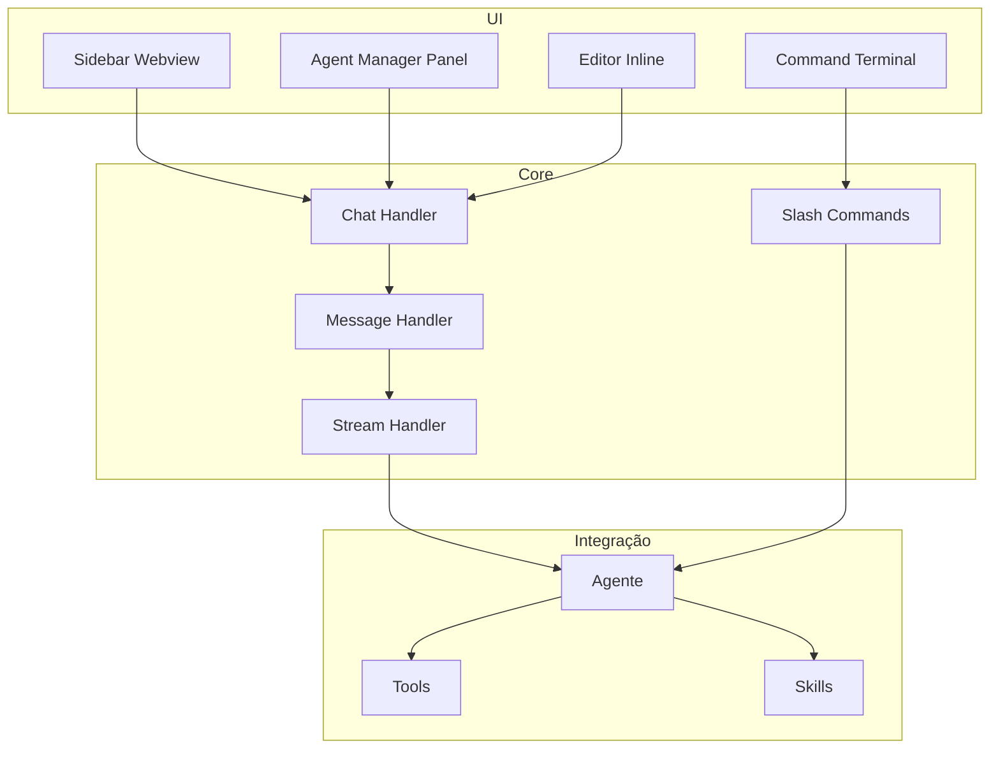
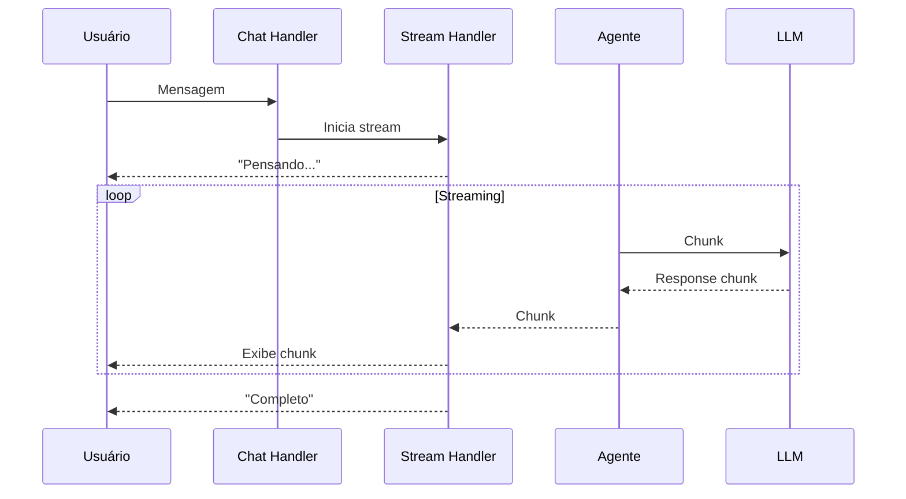

# XForge Code AI — Sistema de Chat

## Visão Geral

O sistema de chat do XForge Code AI combina o melhor de Kilo Code (sidebar + Agent Manager), Cline (diff review), Continue (@context), e adiciona streaming, comandos slash, e skills integration.

## Componentes



## 1. Sidebar Webview

### Componentes
- **Chat Input** — Campo de entrada com suporte a @file, @folder, @codebase
- **Message List** — Lista de mensagens com avatares (usu- **Tool Calls** — Visualização de tool calls com status (pending/success/error)
- **Diff View** — Preview de mudanças com accept/reject
- **Agent Mode Selector** — Seletor de modo (Code/Plan/Ask/Debug/Review)
- **Skills Selector** — Seletor de skills ativas

### Atalhos
| Atalho | Ação |
|--------|------|
| `Ctrl+K` | Abre chat |
| `Ctrl+Shift+K` | Abre Agent Manager |
| `Tab` | Aceita sugestão inline |
| `Ctrl+Enter` | Envia mensagem |
| `Esc` | Cancela streaming |

## 2. Agent Manager Panel

### Funcionalidades
- Lista de sessões ativas
- Criar nova sessão
- Deletar sessão
- Isolar sessão em worktree
- Ver histórico de sessões

### Worktree Isolation
Cada sessão pode ser isolada em um git worktree independente, permitindo que múltiplas tarefas sejam executadas em paralelo sem conflito.

## 3. Slash Commands

| Comando | Descrição |
|---------|-----------|
| `/xforge` | Menu principal |
| `/analisar-projeto` | Analisa o projeto atual |
| `/criar-projeto` | Cria novo projeto |
| `/desenvolver` | Inicia desenvolvimento |
| `/qualidade` | Roda quality gates |
| `/seguranca` | Auditoria de segurança |
| `/conhecimento` | Gerencia conhecimento |
| `/memoria` | Gerencia memória |
| `/documentacao` | Gera documentação |
| `/release` | Gerencia releases |
| `/genius-council` | Inicia debate do conselho |
| `/checkpoint` | Salva checkpoint |
| `/retomar` | Retoma de checkpoint |

## 4. Streaming de Respostas



## 5. Message Types

| Tipo | Descrição |
|------|-----------|
| `user` | Mensagem do usuário |
| `assistant` | Resposta do agente |
| `tool_call` | Chamada de ferramenta |
| `tool_result` | Resultado de ferramenta |
| `system` | Mensagem do sistema |
| `error` | Mensagem de erro |
| `skill` | Resultado de skill |

## 6. Diff Review

Inspirado no Cline, cada mudança de código é mostrada como diff antes de ser aplicada:

```diff
- var nome = cliente.Nome.ToUpper();
+ var nome = cliente?.Nome?.ToUpper();
```

### Ações
- **Accept** — Aplica mudança
- **Reject** — Rejeita mudança
- **Modify** — Modifica antes de aplicar

## Critérios de Aceite

- [ ] Sidebar webview funciona corretamente
- [ ] Agent Manager lista e gerencia sessões
- [ ] Streaming de respostas funciona
- [ ] Slash commands são registrados
- [ ] Diff review mostra mudanças antes de aplicar
- [ ] Atalhos de teclado funcionam
- [ ] Worktree isolation funciona

## Prioridade: P0
