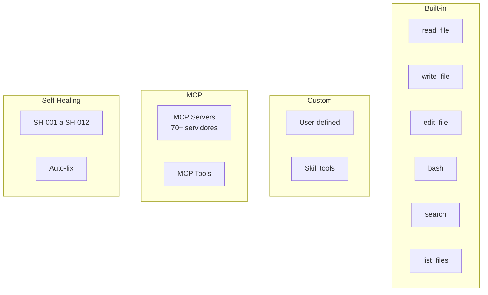
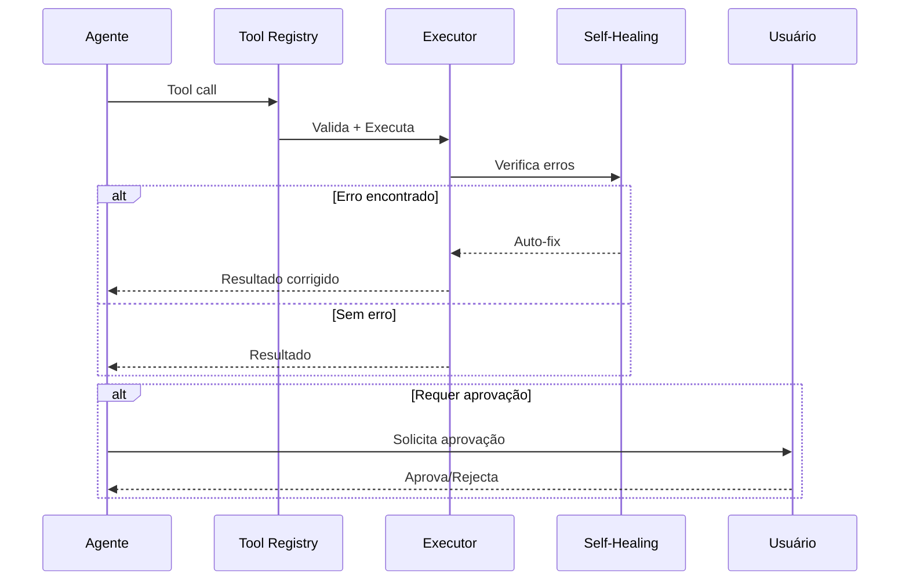

# XForge Code AI — Sistema de Ferramentas

## Visão Geral

O sistema de ferramentas do XForge Code AI é o mais completo entre todos os projetos analisados. Ele combina built-in tools, custom tools, MCP tools, e self-healing tools.

## Tipos de Ferramentas



## 1. Built-in Tools

| Tool | Descrição | Parâmetros |
|------|-----------|------------|
| `read_file` | Lê conteúdo de arquivo | `filePath`, `offset`, `limit` |
| `write_file` | Escreve arquivo novo | `filePath`, `content` |
| `edit_file` | Edita arquivo existente | `filePath`, `oldText`, `newText` |
| `bash` | Executa comando terminal | `command`, `timeout`, `workdir` |
| `search` | Busca no código | `query`, `path`, `regex` |
| `list_files` | Lista arquivos do diretório | `path`, `recursive`, `pattern` |
| `git_status` | Status do git | — |
| `git_diff` | Diff do git | `file`, `staged` |
| `git_log` | Log de commits | `limit`, `file` |
| `knowledge_search` | Busca no knowledge graph | `query`, `domain` |
| `knowledge_save` | Salva entrada de conhecimento | `entry` |
| `decision_create` | Cria decision record | `title`, `context`, `decision` |
| `checkpoint_save` | Salva checkpoint | `taskId`, `state` |
| `checkpoint_load` | Carrega checkpoint | `taskId` |
| `skill_load` | Carrega skill | `skillName` |
| `genius_council` | Inicia debate | `topic`, `geniuses` |

## 2. Custom Tools

### Registro

```typescript
const deployTool = createTool({
  name: "deploy",
  description: "Deploy the current branch to staging",
  inputSchema: {
    type: "object",
    properties: {
      env: { type: "string", enum: ["staging", "production"] }
    },
    required: ["env"]
  },
  execute: async (input) => {
    // deployment logic
  }
});
```

### Segurança
- Custom tools requerem aprovação do usuário
- Sandbox obrigatório para ferramentas que executam código
- Audit trail para todas as execuções

## 3. MCP Tools

### Servidores MCP Suportados

| Servidor | Tipo | Ferramentas |
|----------|------|-------------|
| `github-mcp` | GitHub | 21 toolsets (PRs, Issues, Actions) |
| `linear-mcp` | Linear | Issue tracking |
| `playwright-mcp` | Browser | 50+ ferramentas de browser |
| `plantuml-mcp` | Diagrams | UML/C4 diagrams |
| `microsoft-foundry` | Azure AI | Agent management |
| `custom-user` | User-defined | User-defined tools |

### Registro de Servidor MCP

```typescript
const server = await mcpManager.register({
  name: "github",
  command: "npx",
  args: ["-y", "@modelcontextprotocol/server-github"],
  env: { GITHUB_TOKEN: "..." }
});
```

## 4. Self-Healing Tools

| ID | Tool | Ação |
|----|------|------|
| SH-001 | Remove unused imports | Auto-fix |
| SH-002 | Add Async suffix | Auto-fix |
| SH-003 | Null-conditional access | Auto-fix |
| SH-004 | Missing null check | Auto-fix |
| SH-005 | Async over sync | Auto-fix |
| SH-006 | Missing using declaration | Auto-fix |
| SH-007 | Parameterized query | Auto-fix |
| SH-008 | Secret detection | Move to .env |
| SH-009 | CancellationToken | Auto-fix |
| SH-010 | IHttpClientFactory | Suggest refactor |
| SH-011 | ConfigureAwait | Silent fix |
| SH-012 | Disposable pattern | Suggest refactor |

## 5. Tool Execution Pipeline



## Critérios de Aceite

- [ ] Todas as built-in tools funcionam
- [ ] Custom tools podem ser registradas
- [ ] MCP tools conectam a servidores
- [ ] Self-healing corrige erros automaticamente
- [ ] Tool execution pipeline é seguro
- [ ] Audit trail registra todas as execuções

## Prioridade: P0
