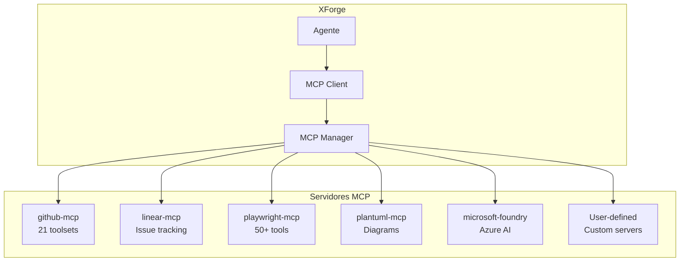
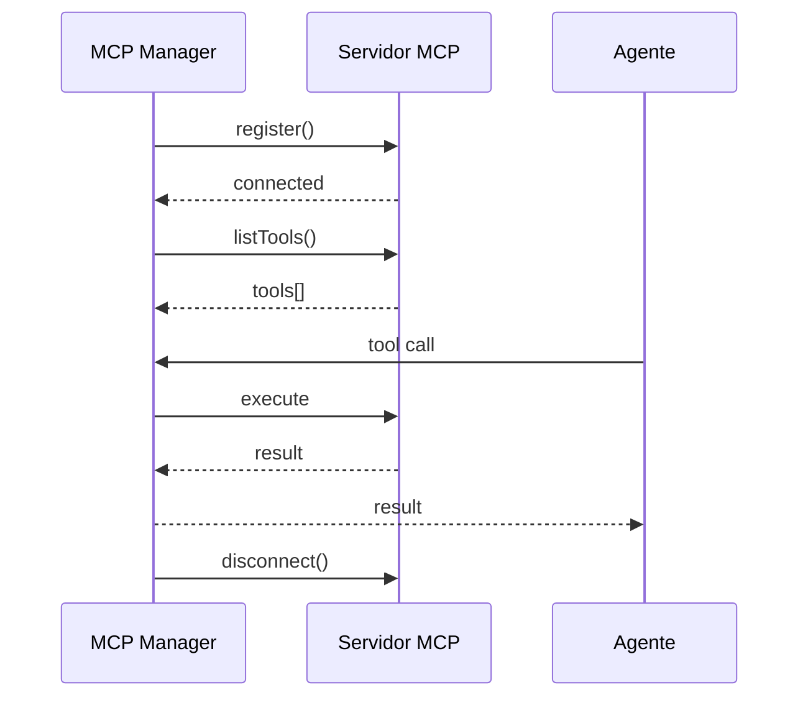

# XForge Code AI — Integração MCP

## Visão Geral

A integração MCP (Model Context Protocol) do XForge Code AI é inspirada no Goose (70+ extensões) e Kilo Code (MCP marketplace), mas com gerenciamento avançado e segurança.

## Arquitetura MCP



## Servidores MCP Suportados

### Oficiais

| Servidor | Package | Ferramentas | Status |
|----------|---------|-------------|--------|
| GitHub | `@modelcontextprotocol/server-github` | 21 toolsets (PRs, Issues, Actions, Code Scanning) | ✅ |
| Linear | `@anthropic/linear-mcp` | Issue tracking | ✅ |
| Playwright | `@playwright/mcp` | 50+ browser tools | ✅ |
| PlantUML | `@mcp/plantuml-mcp-server` | UML/C4 diagrams | ✅ |
| Microsoft Foundry | `@azure/ai-foundry` | Agent management | ✅ |

### Comunidade

| Servidor | Package | Descrição |
|----------|---------|-----------|
| PostgreSQL | `@modelcontextprotocol/server-postgres` | Database queries |
| Filesystem | `@modelcontextprotocol/server-filesystem` | File operations |
| Brave Search | `@modelcontextprotocol/server-brave-search` | Web search |
| Slack |/server-slack` | Slack integration |

### User-defined

```typescript
const customServer = await mcpManager.register({
  name: "my-api",
  command: "node",
  args: ["./my-mcp-server/index.js"],
  env: { API_KEY: process.env.MY_API_KEY }
});
```

## Gerenciamento

### Configuração

```json
{
  "mcpServers": {
    "github": {
      "command": "npx",
      "args": ["-y", "@modelcontextprotocol/server-github"],
      "env": { "GITHUB_PERSONAL_ACCESS_TOKEN": "..." }
    },
    "playwright": {
      "command": "npx",
      "args": ["-y", "@playwright/mcp"]
    }
  }
}
```

### Ciclo de Vida



## Segurança

### Permissões

| Ação | Permissão |
|------|-----------|
| Listar tools | Automático |
| Executar tool read | Automático |
| Executar tool write | Solicitar aprovação |
| Executar tool bash | Solicitar aprovação |
| Registrar servidor | Solicitar aprovação |

### Sandbox
- MCP tools que executam código rodam em sandbox Docker
- File system access é limitado ao diretório do projeto
- Network access é bloqueado por padrão

## Critérios de Aceite

- [ ] Servidores MCP oficiais funcionam
- [ ] User-defined servidores podem ser registrados
- [ ] Tool discovery funciona automaticamente
- [ ] Permissões por tool funcionam
- [ ] Sandbox isola execução
- [ ] Disconnect limpa recursos

## Prioridade: P1
