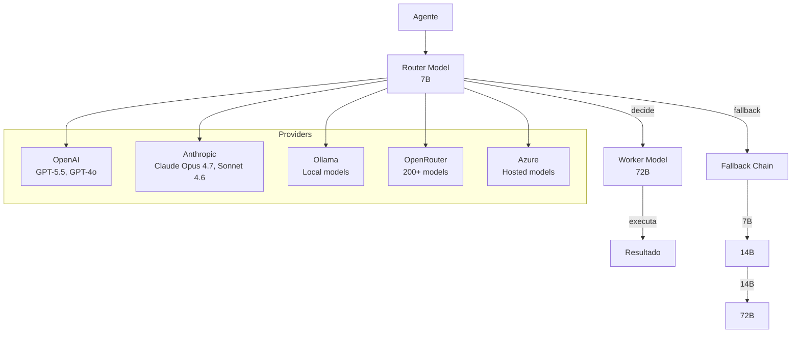

# XForge Code AI — Provedores LLM

## Visão Geral

O sistema de provedores LLM do XForge Code AI suporta 500+ modelos com roteamento inteligente (Router + Worker), fallback chain, e otimização de custo.

## Arquitetura



## Router + Worker Architecture

### Router Model (7B)
- Responsabilidade: Decidir próxima ação
- Custo: Baixo
- Latência: Rápida (< 2s)
- Modelos: Qwen 2.5 7B, Gemma 4B

### Worker Model (72B)
- Responsabilidade: Executar tarefa
- Custo: Alto
- Latência: Mais l-30s)
- Modelos: Qwen 2.5 72B, Claude Sonnet

### Fallback Chain
```
7B (router) → 14B (medium) → 72B (worker) → Claude Opus (premium)
```

## Provedores Suportados

| Provedor | Modelos | Custo | Latência |
|----------|---------|-------|----------|
| OpenAI | GPT-5.5, GPT-4o, GPT-4o-mini | $$$ | Rápida |
| Anthropic | Claude Opus 4.7, Sonnet 4.6, Haiku 4.5 | $$$$ | Rápida |
| Google | Gemini 3.1 Pro, Flash | $$ | Rápida |
| Ollama | Todos os modelos locais | Grátio | Lenta |
| OpenRouter | 200+ modelos | Variável | Variável |
| Azure | Modelos hospedados | $$$ | Rápida |
| AWS Bedrock | Claude, Llama | $$$ | Rápida |

## Seleção Automática de Modelo

### Por Complexidade

| Complexidade | Modelo | Exemplo |
|--------------|--------|---------|
| Trivial (< 3 linhas) | 7B local | Renomear variável |
| Simples (3-10 linhas) | 14B | Criar função |
| Médio (10-50 linhas) | 72B | Criar service |
| Complexo (> 50 linhas) | Claude Opus | Refatorar módulo |

### Por Contexto

| Contexto | Modelo | Razão |
|----------|--------|-------|
| Router decision | 7B | Velocidade |
| Code generation | 72B | Qualidade |
| Code review | Claude Opus | Análise profunda |
| Autocomplete | 7B | Latência |

## Custo Estimado

| Cenário | Sem Router | Com Router | Economia |
|---------|------------|------------|----------|
| Tarefa simples | $0.01 | $0.001 | 90% |
| Tarefa média | $0.10 | $0.02 | 80% |
| Tarefa complexa | $1.00 | $0.30 | 70% |

## Critérios de Aceite

- [ ] Router + Worker funciona com fallback
- [ ] 500+ modelos disponíveis
- [ ] Seleção automática por complexidade
- [ ] Fallback chain é confiável
- [ ] Custo é rastreado
- [ ] Troca mid-task funciona

## Prioridade: P0
