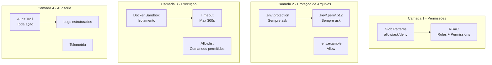

# XForge Code AI — Segurança

## Visão Geral

O sistema de segurança do XForge Code AI é o mais completo entre todos os projetos analisados. Ele combina permissões glob do Kilo Code, sandbox do OpenHands, e adiciona sensitive file protection, LGPD compliance, e RBAC.

## Camadas de Segurança



## 1. Permissões com Glob Patterns

### Regras (última regra matching vence)

```json
{
  "permissions": {
    "bash": {
      "allow": ["*"],
      "ask": ["git push --force", "rm -rf *", "curldeny": ["sudo *", "chmod 777 *"]
    },
    "files": {
      "allow": ["src/*", "tests/*", "docs/*"],
      "ask": [".env", ".env.*", "*.key", "*.pem", "*.p12"],
      "deny": []
    }
  }
}
```

### Precedência
1. Broad fallbacks primeiro
2. Exceções depois
3. Última regra matching vence

## 2. Proteção de Arquivos Sensíveis

| Arquivo | Ação | Justificativa |
|---------|------|---------------|
| `.env`, `.env.*` | Sempre ask | Contém segredos |
| `*.key`, `*.pem`, `*.p12` | Sempre ask | Chaves criptográficas |
| `.env.example` | Allow | Documentação |
| `appsettings.json` | Ask | Pode conter connection strings |
| `secrets.json` | Sempre ask | Segredos |

## 3. Sandbox de Execução

### Docker Sandbox
```typescript
const sandbox = await sandboxManager.create({
  image: "node:20-alpine",
  cwd: "/workspace",
  network: false,
  memory: "512m",
  cpus: 1,
  timeout: 300
});
```

### Comandos Permitidos

| Categoria | Permitidos | Bloqueados |
|-----------|------------|------------|
| Git | `git add`, `git commit`, `git push` | `git push --force` |
| Build | `npm run build`, `dotnet build` | `rm -rf /` |
| Test | `npm test`, `pytest` | `sudo *` |
| Package | `npm install`, `pip install` | `curl \| sh` |

## 4. RBAC

| Papel | Permissões |
|-------|------------|
| **developer** | read, write, bash (limitado) |
| **lead** | read, write, bash, approve breaking changes |
| **admin** | tudo, incluindo alterar policies |
| **viewer** | read only |

## 5. LGPD Compliance

### Princípios
- **Minimização**: Coleta apenas dados necessários
- **Isolamento**: Memória isolada por projeto
- **Retenção**: Dados retidos apenas durante a sessão
- **Auditoria**: Todas as ações são logadas
- **Direito ao esquecimento**: Usuário pode deletar todos os dados

### Implementação
```typescript
// Nunca salvar dados pessoais em learning.jsonl
const sanitized = sanitizePII(userInput);
await learningLog.save(sanitized);
```

## 6. Audit Trail

### Estrutura

```json
{
  "id": "AUD-20260627-001",
  "timestamp": "2026-06-27T10:00:00Z",
  "user": "renato",
  "agent": "xforge-code-ai",
  "action": "file_write",
  "target": "src/service.ts",
  "provider": "openrouter/owl-alpha",
  "model": "qwen2.5-72b",
  "tokens": 1500,
  "cost": 0.003,
  "risk": "low",
  "approved": true
}
```

## Critérios de Aceite

- [ ] Glob patterns funcionam corretamente
- [ ] Arquivos sensíveis sempre requerem aprovação
- [ ] Sandbox isola execução
- [ ] RBAC controla permissões
- [ ] LGPD compliance é respeitada
- [ ] Audit trail registra todas as ações
- [ ] Comandos perigosos são bloqueados

## Prioridade: P0
