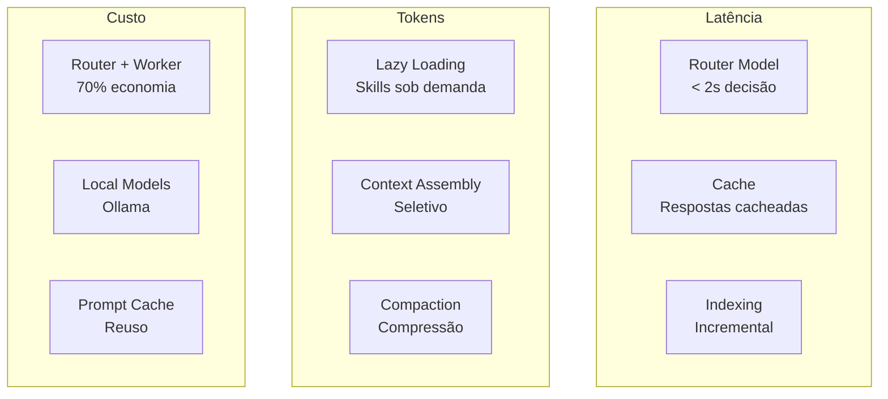

# XForge Code AI — Performance

## Visão Geral

O sistema de performance do XForge Code AI é otimizado para minimizar latência, tokens e custo, inspirado no Kilo Code (Router+Worker) e Twinny (local-first).

## Otimizações

## 1. Latência

### Router Model (< 2s)
- Decisão rápida de próxima ação
- Modelo leve (7B)
- Cache de decisões comuns

### Streaming
- Primeiro token em < 2s
- Chunks de 50ms
- Progressive rendering

### Indexing Incremental
- Apenas arquivos alterados são re-indexados
- Debounce de 5s para evitar re-indexação em batch
- Background indexing não bloqueia UI

## 2. Token Optimization

### Lazy Loading de Skills
- Apenas metadata no system prompt (< 500 chars por skill)
- Body completo carregado apenas quando skill é invocada
- Redução de 80% no system prompt

### Context Assembly Seletivo
- Apenas arquivos referenciados (@file, @folder)
- Per-directory AGENTS.md (não todo o conteúdo)
- Knowledge Graph relevante (não todo o grafo)

### Compaction
- Quando contexto atinge 80%: sumarizar mensagens antigas
- Preservar: system prompt, definições de tools, mensagens recentes
- Nunca perder: decisões tomadas, arquivos modificados

## 3. Cache

### Prompt Cache
- System prompt cacheado (não re-enviado)
- Tool definitions cacheadas
- Context prefix cacheado

### Response Cache
- Respostas idênticas cacheadas (hash do prompt)
- TTL: 1 hora
- Invalidação: mudança de modelo

### Embedding Cache
- Embeddings de arquivos cacheados
- Invalidação: mudança de conteúdo
- Armazenamento: SQLite local

## 4. Modelos Locais (Ollama)

### Quando Usar
- Tarefas triviais (< 3 linhas)
- Quando latência é crítica
- Quando custo é preocupante

### Modelos Recomendados

| Modelo | Uso | VRAM |
|--------|-----|------|
| qwen2.5:7b | Router | 8GB |
| qwen2.5:14b | Worker leve | 16GB |
| qwen2.5:72b | Worker pesado | 48GB |
| nomic-embed-text | Embeddings | 4GB |

## 5. Métricas

| Métrica | Meta | Medição |
|---------|------|---------|
| Primeiro token | < 2s | p95 |
| Tool execution | < 5s | p95 |
| Resposta completa | < 30s | p95 |
| Token economy | > 60% | vs single-model |
| Cache hit rate | > 30% | prompts cacheados |
| Indexing time | < 30s | projeto médio |

## Critérios de Aceite

- [ ] Primeiro token < 2s
- [ ] Lazy loading reduz system prompt em 80%
- [ ] Compaction preserva informações críticas
- [ ] Cache hit rate > 30%
- [ ] Modelos locais funcionam para tarefas triviais
- [ ] Métricas são coletadas

## Prioridade: P1
