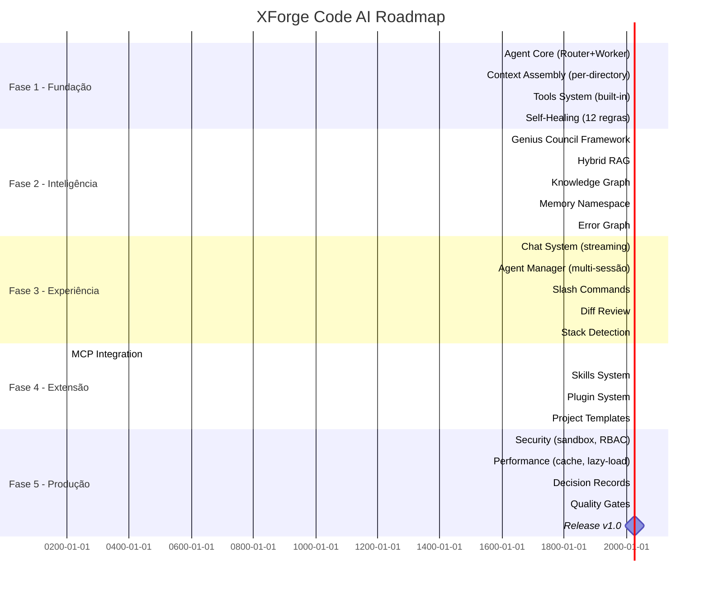

# XForge Code AI — Roadmap de Implementação

## Visão Geral

Este roadmap consolida toda a análise dos 10 projetos de referência e define o plano de implementação do XForge Code AI em 5 fases.

## Fases

## Fase 1 — Fundação (Julho 2026)

### Objetivo
Criar o núcleo funcional do XForge Code AI.

### Entregas

| Componente | Prioridade | Esforço | Dependências |
|------------|------------|---------|--------------|
| Agent Core (Router+Worker) | P0 | 30d | — |
| Context Assembly (per-directory) | P0 | 20d | — |
| Tools System (built-in) | P0 | 20d | Agent Core |
| Self-Healing (12 regras) | P0 | 15d | Agent Core |
| Checkpoint + Resume | P1 | 15d | Agent Core |
| Providers (multi-provedor) | P0 | 10d | — |

### Critérios de Aceite
- [ ] Agente responde a prompts básicos
- [ ] Router + Worker funciona com fallback
- [ ] Per-directory AGENTS.md funciona
- [ ] Built-in tools (read/write/edit/bash) funcionam
- [ ] Self-healing corrige erros comuns
- [ ] Checkpoint salva e restaura estado

## Fase 2 — Inteligência (Agosto 2026)

### Objetivo
Adicionar inteligência avançada (Genius Council, RAG, Knowledge Graph).

### Entregas

| Componente | Prioridade | Esforço | Dependências |
|------------|------------|---------|--------------|
| Genius Council Framework | P0 | 30d | Agent Core |
| Hybrid RAG | P0 | 25d | Context Assembly |
| Knowledge Graph | P1 | 20d | RAG |
| Memory Namespace | P0 | 15d | — |
| Error Graph | P1 | 15d | — |
| Decision Records | P1 | 10d | Genius Council |

### Critérios de Aceite
- [ ] Genius Council debate e consolida decisões
- [ ] Hybrid RAG busca em 4 fontes
- [ ] Knowledge Graph com TTL e trust score
- [ ] Memory isolada por projeto
- [ ] Error graph rastreia padrões
- [ ] Decision Records são gerados automaticamente

## Fase 3 — Experiência (Setembro 2026)

### Objetivo
Criar a melhor experiência de usuário.

### Entregas

| Componente | Prioridade | Esforço | Dependências |
|------------|------------|---------|--------------|
| Chat System (streaming) | P0 | 20d | Agent Core |
| Agent Manager (multi-sessão) | P0 | 25d | Agent Core |
| Slash Commands | P1 | 10d | Chat System |
| Diff Review | P1 | 15d | Chat System |
| Stack Detection | P1 | 10d | Context Assembly |
| Inline Autocomplete | P2 | 20d | — |

### Critérios de Aceite
- [ ] Streaming de respostas funciona
- [ ] Agent Manager lista e gerencia sessões
- [ ] Slash commands são registrados
- [ ] Diff review mostra mudanças antes de aplicar
- [ ] Stack detection identifica .NET, Node, Python, Go, Rust, Java
- [ ] Autocomplete inline funciona

## Fase 4 — Extensão (Outubro 2026)

### Objetivo
Permitir extensibilidade via MCP, skills e plugins.

### Entregas

| Componente | Prioridade | Esforço | Dependências |
|------------|------------|---------|--------------|
| MCP Integration | P1 | 20d | Tools System |
| Skills System | P1 | 20d | — |
| Plugin System | P2 | | Skills System |
| Project Templates | P2 | 15d | Stack Detection |
| Custom Agents | P2 | 15d | Agent Core |

### Critérios de Aceite
- [ ] MCP servers oficiais funcionam
- [ ] Skills são carregáveis dinamicamente
- [ ] Plugins podem registrar tools e hooks
- [ ] Templates funcionam para todos os stacks
- [ ] Custom agents podem ser criados

## Fase 5 — Produção (Novembro 2026)

### Objetivo
Preparar para release v1.0.

### Entregas

| Componente | Prioridade | Esforço | Dependências |
|------------|------------|---------|--------------|
| Security (sandbox, RBAC) | P0 | 20d | — |
| Performance (cache, lazy-load) | P0 | 15d | — |
| Quality Gates | P1 | 15d | — |
| Documentation | P1 | 20d | — |
| Testing (unit, integration) | P0 | 20d | — |
| Release v1.0 | P0 | 5d | Todos |

### Critérios de Aceite
- [ ] Sandbox Docker funciona
- [ ] RBAC controla permissões
- [ ] Cache hit rate > 30%
- [ ] Quality gates passam
- [ ] Documentação completa
- [ ] Testes passam (coverage > 80%)
- [ ] Release v1.0 publicada

## Backlog Priorizado

### P0 (Crítico)
1. Agent Core (Router + Worker)
2. Context Assembly (per-directory)
3. Tools System (built-in)
4. Genius Council Framework
5. Hybrid RAG
6. Memory Namespace
7. Security (sandbox, RBAC)
8. Performance (cache, lazy-load)

### P1 (Importante)
1. Self-Healing (12 regras)
2. Knowledge Graph
3. Chat System (streaming)
4. Agent Manager (multi-sessão)
5. MCP Integration
6. Skills System
7. Decision Records
8. Quality Gates

### P2 (Desejável)
1. Error Graph
2. Slash Commands
3. Diff Review
4. Stack Detection
5. Plugin System
6. Project Templates
7. Inline Autocomplete
8. Custom Agents

### P3 (Futuro)
1. Marketplace (skills, plugins)
2. Messaging integration (Slack, Telegram)
3. Scheduled agents
4. Pair programming mode
5. Voice input
6. Collaborative sessions

## Métricas de Sucesso

| Métrica | Meta |
|---------|------|
| Tempo de resposta (p95) | < 30s |
| Token economy | > 60% |
| Cache hit rate | > 30% |
| Cobertura de testes | > 80% |
| Satisfação do usuário | > 4.5/5 |
| Tempo de onboarding | < 5 min |

## Riscos e Mitigações

| Risco | Probabilidade | Impacto | Mitigação |
|-------|---------------|---------|-----------|
| Complexidade do Genius Council | Alta | Alto | Implementar em fases |
| Performance do Hybrid RAG | Média | Alto | Cache agressivo |
| Compatibilidade MCP | Média | Médio | Testar com 70+ servidores |
| Scope creep | Alta | Alto | Roadmap rigoroso |
| Dependência de modelos locais | Baixa | Médio | Fallback para cloud |
